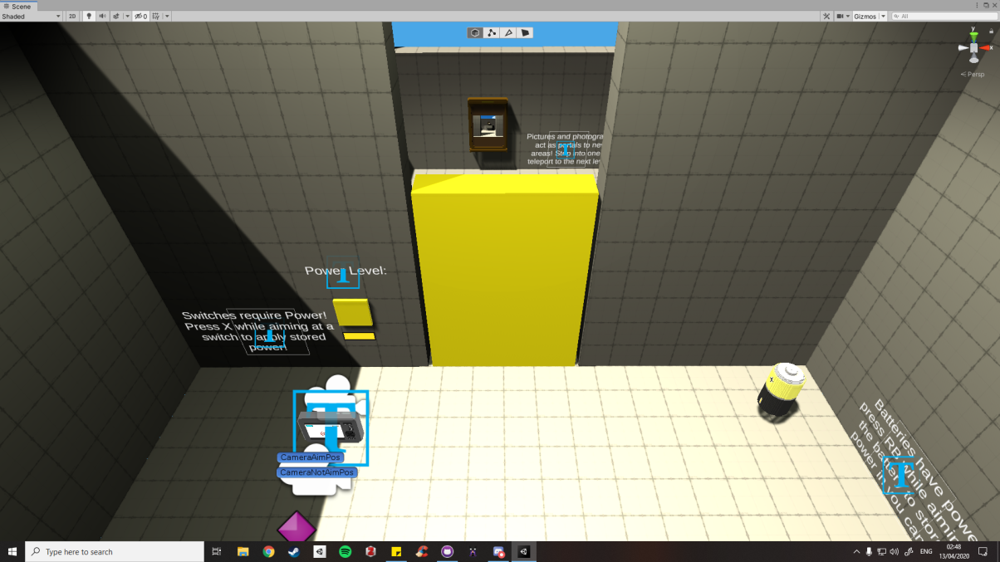
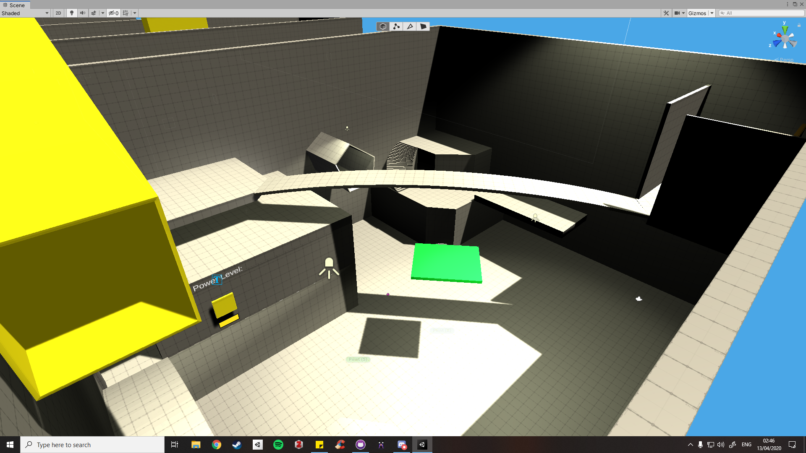

# IndividualPrototypeRepo
This prototype is for an assignment for my Prototyping module in TU984 at Technological University Dublin City Campus.
This game is called Photo, where the player has access to a magic camera that can take the properties of an object and 
apply them to another. A simple puzzle platformer, it takes a lot of inspiration from an unreleased Portal prototype.

## Screenshots:

# Asset References:

### Music:
- Royalty // Free Download Ambient Music, by Mattia Cupelli on YouTube

- Bobbin,by David Renda on https://www.fesliyanstudios.com/

### Font: 
- Coder's Crux, by ChequeredInk

### Probuilder: 
- Unity Package

### Skybox: 
- Fantasy Skybox Free, G.E. Team

### Sound Effects:
- Space Explosion, by MorganPurkis
- sp0000, by deadlymustard
- stun, by runnerpack
- lazer, by tmokonen
- 69pearldrop, by fschaeffer
- sbd-ouch, by komanderkyle
- book-drop-2, by spacejoe
- foley_footstep_single_shoe_female_boot_leather_buckle_solid_ground, by zapsplat
- technology_camera_dslr_switch_on_or_off_canon_eos_6d_002, by zapsplat
- technology_camera_dslr_take_picture_shutter_close_open_001_. by zapsplat

***For any issues with crediting please shoot me a message. I will try make the appropriate edits. Thanks for reading!***
